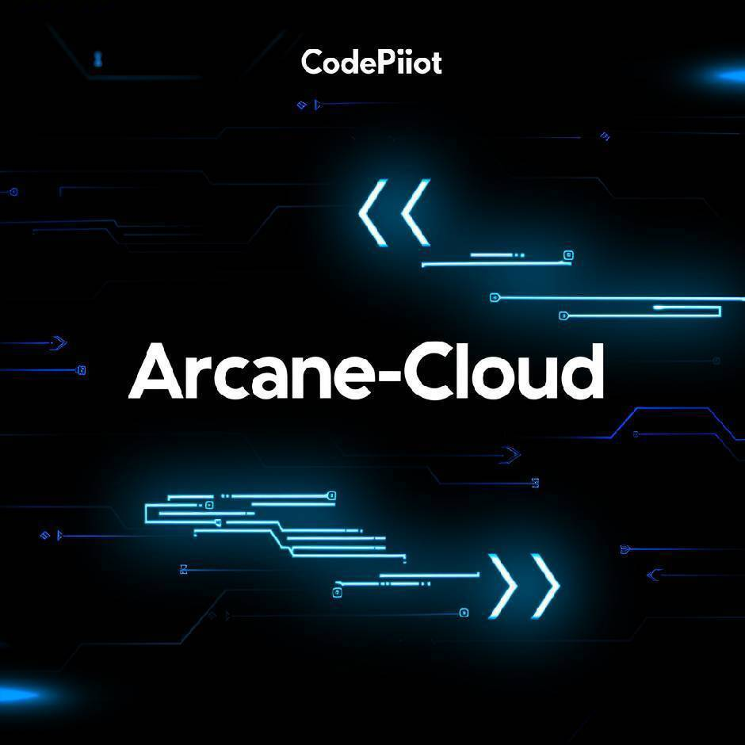

# Arcane Markdown

<div align="center">



**A powerful, block-based Markdown editor built for the modern web.**

[English](./README.md) | [简体中文](./README_zh.md)

[](https://opensource.org/licenses/MIT)
[](https://github.com/Arcane-Cloud/Arcane-Markdown/.github/workflows/ci.yml)

</div>

## ✨ Features

- **Block-Based Editing**: Intuitive drag-and-drop interface for organizing content.
- **Rich Content Support**:
  - Headings, Paragraphs, Quotes
  - Lists (Ordered, Unordered, Checklist) with smart grouping
  - Code Blocks with syntax highlighting (PrismJS) and auto-indentation
  - Math Equations (LaTeX)
  - Mermaid Diagrams
  - Tables, Details, Images
  - Callouts (Info, Warning, Success, Error)
- **Real-time Preview**: What you see is what you get.
- **Export**: One-click export to standard `.md` files.
- **Internationalization**: English and Chinese support.

## 🛠 Tech Stack

- **Framework**: [Next.js 16](https://nextjs.org/) (App Router)
- **Language**: [TypeScript](https://www.typescriptlang.org/)
- **Styling**: [Tailwind CSS 4](https://tailwindcss.com/)
- **UI Components**: [Shadcn UI](https://ui.shadcn.com/)
- **Icons**: [Lucide React](https://lucide.dev/)
- **Markdown Processing**: [React Markdown](https://github.com/remarkjs/react-markdown) & [Remark GFM](https://github.com/remarkjs/remark-gfm)
- **Syntax Highlighting**: [PrismJS](https://prismjs.com/)
- **Form Handling**: [React Hook Form](https://react-hook-form.com/) & [Zod](https://zod.dev/)

## 🚀 Getting Started

### Prerequisites

- Node.js 18+
- npm or pnpm

### Installation

1.  **Clone the repository:**

    ```bash
    git clone https://github.com/Arcane-Cloud/Arcane-Markdown.git
    cd Arcane-Markdown
    ```

2.  **Install dependencies:**

    ```bash
    npm install
    ```

3.  **Configure environment variables:**
    Copy `.env.example` to `.env`:

    ```bash
    cp .env.example .env
    ```

4.  **Start the development server:**

    ```bash
    npm run dev
    ```

5.  **Open the application:**
    Visit [http://localhost:3001](http://localhost:3001) in your browser.

## 📦 Building for Production

To create a production build:

```bash
npm run build
```

This project uses Next.js static export (`output: 'export'`) with relative paths configured, so the build output will be in the `out/` directory.

You can now:
1.  Run `npm run preview` to start a local server (Recommended).
2.  Or double-click `preview.bat` (Windows).
3.  **Technically**, you can also open `out/index.html` directly in your browser, as we have enabled relative paths (`assetPrefix: './'`). However, some advanced routing features might still require a server.

## 📚 Documentation
- [API Documentation](./docs/API.md)

## 🤝 Contributing

Contributions are welcome! Please check our [Contributing Guide](./CONTRIBUTING.md) for details.

1.  Fork the Project
2.  Create your Feature Branch (`git checkout -b feature/AmazingFeature`)
3.  Commit your Changes (`git commit -m 'Add some AmazingFeature'`)
4.  Push to the Branch (`git push origin feature/AmazingFeature`)
5.  Open a Pull Request